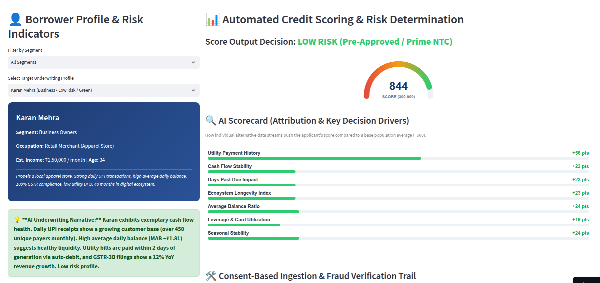
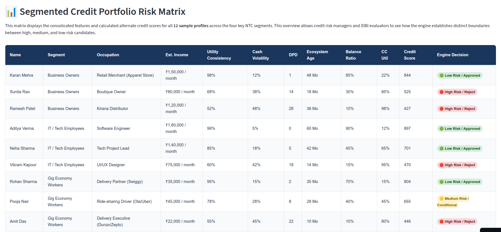

# IDBI Innovate 2026 - NTC Portfolios: Credit Risk Analyzer (NTC/NTB Segment)

An explainable, AI-driven risk assessment framework designed specifically for the **New-to-Credit (NTC)** and **New-to-Bank (NTB)** MSME segments in India (gig-economy workers, small kirana merchants, and rural entrepreneurs) who lack traditional credit histories.

---

## 📌 Section 1: Prototype Simulation Dashboard & Implementation Strategy

### 🎯 Alignment with Hackathon Track 03: Financial Inclusion & Digital Lending
* **The Problem**: MSME credit evaluation relies heavily on traditional documents (e.g., ITRs, formal audits, and CIBIL histories) which credit-invisible NTC and NTB enterprises lack or maintain inadequately. Despite rich alternate data footprints (GST, UPI, AA, EPFO), the absence of a unified scoring framework leads to high rejection rates.
* **The Outcome**: This prototype designs and evaluates a multidimensional **MSME Financial Health Card** that aggregates alternate data signals, computes a credit score, visualizes strengths and risks, and prepares the operational pathway to integrate with ULI, OCEN, and AA ecosystems.
* **The Strategy**: To validate the model's reliability across diverse target groups, the prototype embeds **12 distinct personas** categorized into 4 NTC segments:
  1. **Business Owners**: Spanning a low-risk retail merchant, a medium-risk boutique owner, and a distressed/bankrupt kirana distributor.
  2. **IT & Tech Employees**: Showing how salaried tech workers behave on digital payment rails.
  3. **Gig Economy Workers**: Delivery partners and drivers with high-frequency, variable income streams.
  4. **Rural Entrepreneurs & Local Shops**: Small dairy farmers, tea stalls, and weavers dependent on seasonal fluctuations.

### 🕹️ How to Run the Prototype Dashboard

### App URL: https://ntc-portfolios-credit-risk-analyzer-idbi-curiousvt.streamlit.app/

If you see below screen just click `Yes, get this app back up!` wait for 2-3 minutes it will come online immediately

`This app has gone to sleep due to inactivity. Would you like to wake it back up?`


#### To run the app locally for yourself:
Ensure you have activated your virtual environment:
```bash
git clone https://github.com/vijayrmourya/ntc-portfolios-credit-risk-analyzer.git
cd ntc-portfolios-credit-risk-analyzer

python3 -m venv .venv
source .venv/bin/activate
pip install -r requirements.txt
streamlit run app.py
```

Open `http://localhost:8501` to view the interactive portal.

### 🔍 Walkthrough of Dashboard Sections & Simulated Metrics

#### 1. 👤 Credit Score Dashboard
* **Applicant Selection & Filtering**: Allows the evaluator to filter applicants by segment and select specific target profiles.
* **Real-time Data Tuning Sliders**: Simulates live API updates. You can adjust:
  * *Utility & BBPS consistency (%)* (Proxy for household financial discipline)
  * *Cash Flow Velocity (%)* (Frequency and strength of inflows)
  * *Days Past Due (DPD)* (Tracks micro-delinquency events)
  * *Ecosystem Age (Months)* (Measures digital longevity to filter synthetic identity fraud)
  * *Average Balance Ratio (%)* (Liquidity cushion left in accounts)
  * *Credit Utilization (%)* (Debt leverage proxy)
  * *Seasonal Revenue Stability* (Protects primary sectors like agriculture from false default flags during dry periods)
* **Real-Time Underwriting Assessment (SVG Gauge)**: Computes a credit score from 300 to 900 in real-time. Rendered using a lightweight, zero-crash SVG gauge with custom gradients.
* **Explainable AI (SHAP Value Attribution)**: Renders positive and negative score attributions (in green and red) inside an isolated iframe, helping credit officers explain decisions to auditors and applicants.
* **Verification & Ingestion Audit Trail**: Connects the simulated features with target proxy platforms:
  * *GSTN & AA logs* for cash flow verification.
  * *EPFO* metadata checks to verify employment stability.
  * *BBPS API* endpoints to audit payment history.

#### 2. ⚙️ IDBI Evaluator Implementation Guide
* Details the concrete deployment roadmap for IDBI Bank to transit from prototype to production.
* Lists metrics for underwriting and fraud prevention, including NPCI database lookups and locally parsed SMS header cryptographic checks to prevent spoofing.

#### 3. 📊 Multi-Persona Portfolio Matrix
* Displays all 12 personas side-by-side inside a custom HTML table. Status pills (🟢 Approved, 🟡 Conditional, 🔴 Reject) highlight credit decision boundaries.

### Sample Imagaes from hosted app





---

## 🏗️ Section 2: Production Architecture Blueprint & Enterprise Implementation

To deploy this alternate credit scoring engine safely within an industry-standard banking ecosystem, the system shifts away from local code blocks to a **decoupled, event-driven serverless architecture**.


---

## 🛠️ The Enterprise Production Stack: Real Tools & Frameworks

### 1. Consent-Driven Data Ingestion
* **Real-World Integration**: India's **Account Aggregator (AA) Network** and **GSTN APIs** managed under the **DEPA framework**.
* **Workflow**: Decrypted financial statement payloads are requested on-demand only when a user triggers an application event, eliminating the security risks of 24/7 continuous account monitoring.

### 2. Workflow Orchestration
* **Real-World Integration**: **AWS Step Functions** + **Amazon API Gateway**.
* **Workflow**: Step Functions orchestrate the API callouts to the AA, GST, and BBPS networks in parallel, handling retry logic and timeout exceptions gracefully.

### 3. Serverless Feature Extraction
* **Real-World Integration**: **AWS Lambda** (Python).
* **Workflow**: Extract alternate parameters (Cash Flow consistency, DPD, Ecosystem Age) on the fly directly from the fetched JSON files without maintaining permanent compute servers.

### 4. Serverless ML Inference & Explainability
* **Real-World Integration**: **Amazon SageMaker Serverless Inference** + **AWS Lambda (SHAP Engine)**.
* **Workflow**: Hosts the trained XGBoost/LightGBM model and processes credit decisions only on invocation, scaling automatically to zero when inactive to minimize cloud infrastructure costs.

### 5. CBS Delivery Gateway
* **Real-World Integration**: **AWS Direct Connect / VPN** routing into IDBI's **Infosys Finacle CBS**.
* **Workflow**: Pushes the calculated credit score, PDF report, and SHAP attribution metrics directly into Finacle webhooks for immediate loan approval execution.

#### =========================© 2026 Vijay Mourya. All Rights Reserved.=========================

> [!IMPORTANT]
> **NOTICE**
>
> © 2026 Vijay Mourya. All Rights Reserved.
>
> This technical blueprint, comprising the proprietary multi-persona logic, dynamic transactional risk-scoring metrics, and XAI compliance framework, constitutes the exclusive intellectual property of the author.
>
> Access and operational rights are granted solely for evaluation purposes within the IDBI Innovate 2026 Hackathon Core Challenge Track.  
> **Event URL:** [IDBI Innovate 2026 Hackathon](https://hack2skill.com/event/idbinnovate/?utm_source=hack2skill&utm_medium=homepage&sectionid=6a25acee3b5d90996644544c)
>
> For developer queries or licensing inquiries, contact: [vijayrmourya@gmail.com](mailto:vijayrmourya@gmail.com)
